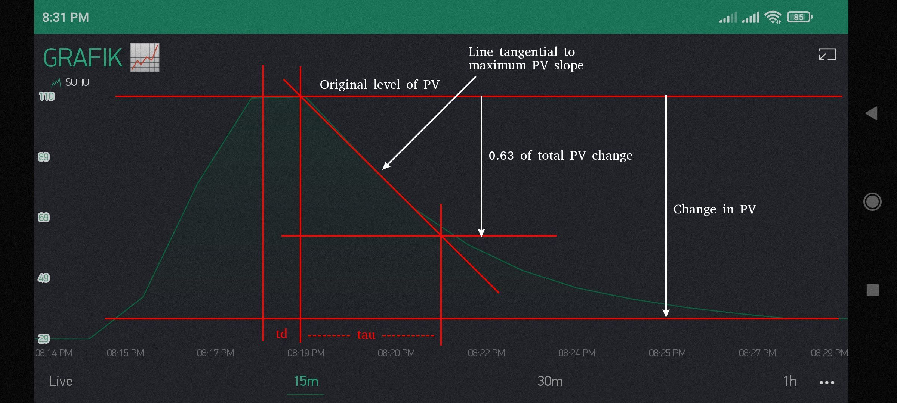

## Grafik



## Deskripsi

`gp = change in PV [in %] / change in CO [in %]`

`td = time difference between the change in CO and the intersection of the tangential line and the original PV level.`

`tau = time difference between intersection at the end of dead time, and the PV reaching 63% of its total change.`

## Konstanta Tuning

```
gp (process gain) = 0.682
td (dead time) = 50 detik
tau (time constant) = 150 detik
```

## Cohen-Coon Tuning Rules


## Tabel Hasil Konstanta PID

|   | Controller Gain | Integral Time | Derivative Time |
| - | -               | -             | -               |
| P Controller   | 5.0443 |          |         |
| PI Controller  | 4.08   | 98.624   |         |
| PD Controller  | 5.689  |          | 11.5455 |
| PID Controller | 6.3046 | 110.2534 | 17.4254 |
